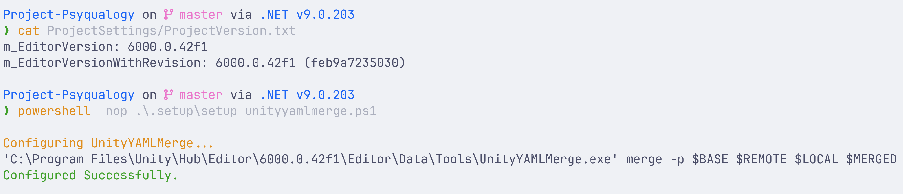

# Unity Project Setup Scripts

Make Unity Projects work better with Git.

Currently for Windows only.

<!-- add screenshot.png -->



## What it does

- `unityyamlmerge` mergetool added to `.git/config`, to be used with `.gitattributes`
- Unity scene merges work better, with [mergerules](mergerules.txt) that ignore negligible differences.
- `git pull` now uses rebase (cleaner history when pulling from master)
- Submodules get automatically fetched when you `git pull/fetch`

## Installation

Download as zip, and extract to Unity project root.

Or clone the repository:
```powershell
cd $UnityProjectRoot
git clone https://www.github.com/Maoyeedy/UnityProjectSetupScripts.git
rm -r -fo SetupScripts/.git
```

Or add as submodule:
```powershell
git submodule add https://www.github.com/Maoyeedy/UnityProjectSetupScripts.git
```

Or use degit:
```powershell
degit Maoyeedy/UnityProjectSetupScripts
```

## Usage

### Recommended
Double-click `Setup.bat` - it'll launch powershell with admin rights and run everything.

### Manually
```powershell
# Run as admin
powershell -nop .\UnityProjectSetupScripts\setup-all.ps1

# Run each script separately
powershell -nop .\UnityProjectSetupScripts\setup-unityyamlmerge.ps1
```

## Troubleshooting

- Unity Hub should be installed, as I use `$env:APPDATA\UnityHub\secondaryInstallPath.json` to retrieve installation paths.
- Unity and Git need to be installed, of course.

## TODO
- [ ] Add `--verbose` argument.
- [ ] Make `Setup.bat` has interactive 'which scripts to run' toggles.
- [ ] Make it work with Linux and MacOS
- [ ] Make it able to run with `irm | iex`
- [ ] Write a JS/TS version so that it can be run with `npx`.
