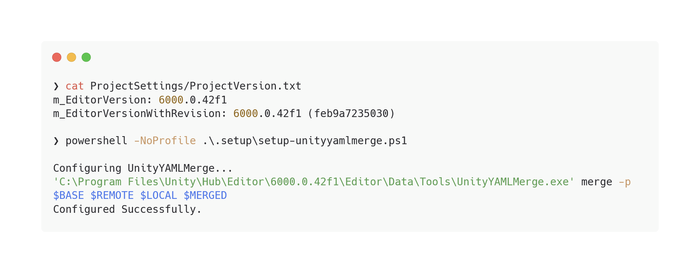

# Unity Project Setup Scripts

Make Unity Projects work better with Git.

Currently for Windows only.


<!--  -->

## What they do

- Add `unityyamlmerge` mergetool added to `.git/config`, to be used with `.gitattributes`
- Add [mergerules](Scripts/mergerules.txt) to make `unityyamlmerge` ignore negligible differences. [(Source)](https://docs.unity3d.com/Manual/SmartMerge.html)
- Make `git pull` uses rebase (for cleaner history when pulling from origin)
- Make submodules also get fetched when you execute `git pull/fetch`

(Details can be found in each `.ps1` scripts, you may also modify them to your liking.)

## Installation

Download as zip, and extract to Unity project root.

Or clone the repository:
```powershell
cd $UnityProjectRoot
git clone https://www.github.com/Maoyeedy/UnityProjectSetupScripts.git .setup
rm -r -fo .setup/.git
```

Or add as submodule:
```powershell
git submodule add https://www.github.com/Maoyeedy/UnityProjectSetupScripts.git .setup
```

Or use degit:
```powershell
degit Maoyeedy/UnityProjectSetupScripts .setup
```

## Usage

### Recommended
Double-click `Setup.bat` - it'll launch powershell with admin rights and run everything.

### Manually
```powershell
# Launch new admin powershell with this
& ./.setup/Setup.bat

# Run each script separately
powershell -NoProfile ./.setup/Scripts/setup-unityyamlmerge.ps1
```

## Troubleshooting

- Unity Hub should be installed, as I use `$env:APPDATA\UnityHub\secondaryInstallPath.json` to retrieve installation paths.
- Unity and Git need to be installed, of course.

## TODO
- [ ] Add `--verbose` argument.
- [ ] Make `Setup.bat` has interactive 'which scripts to run' toggles.
- [ ] Make it work with Linux and MacOS
- [ ] Make it able to run with `irm | iex`
